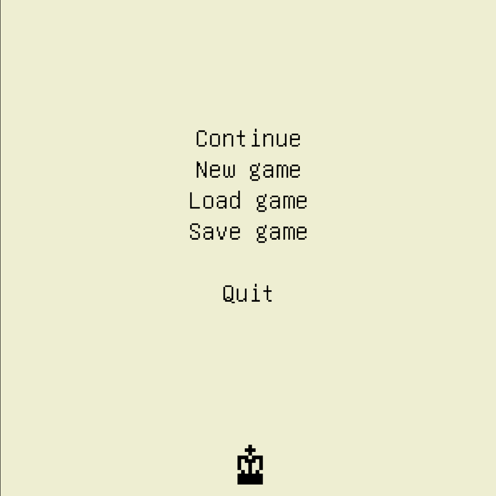
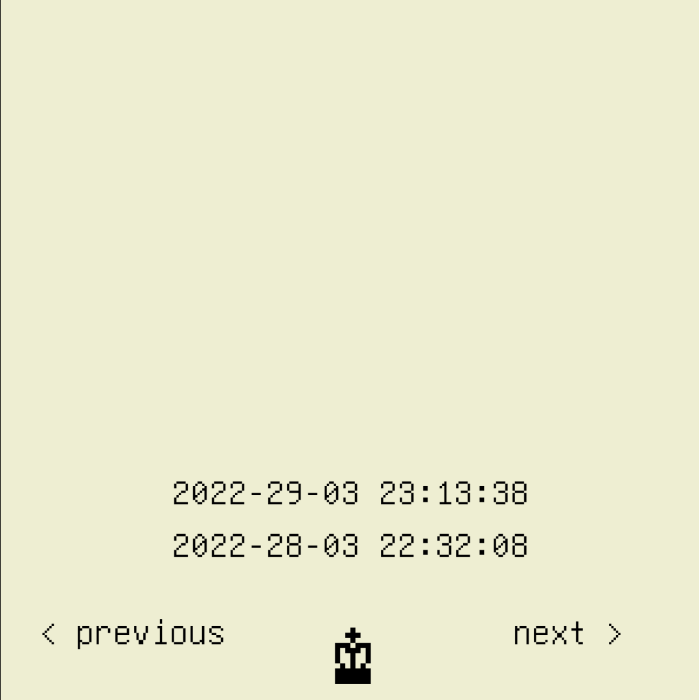
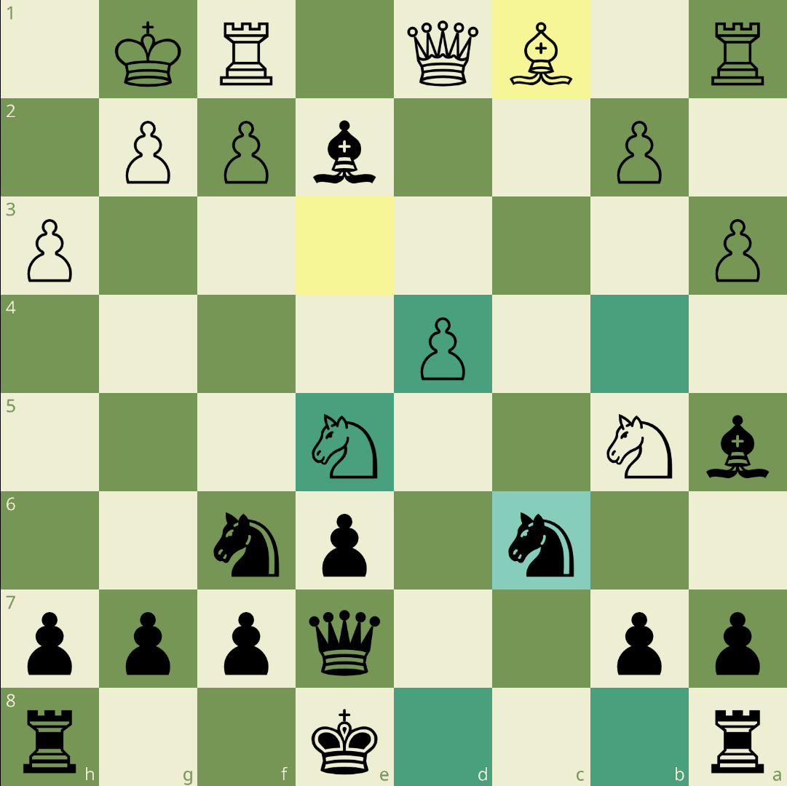
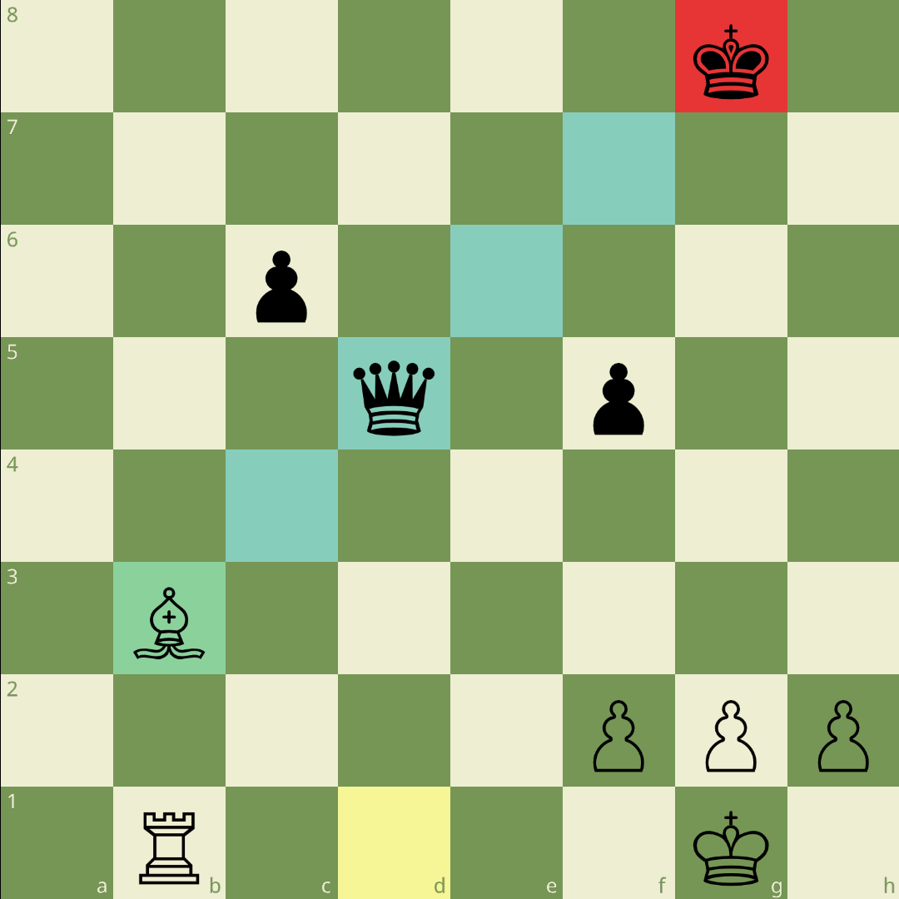
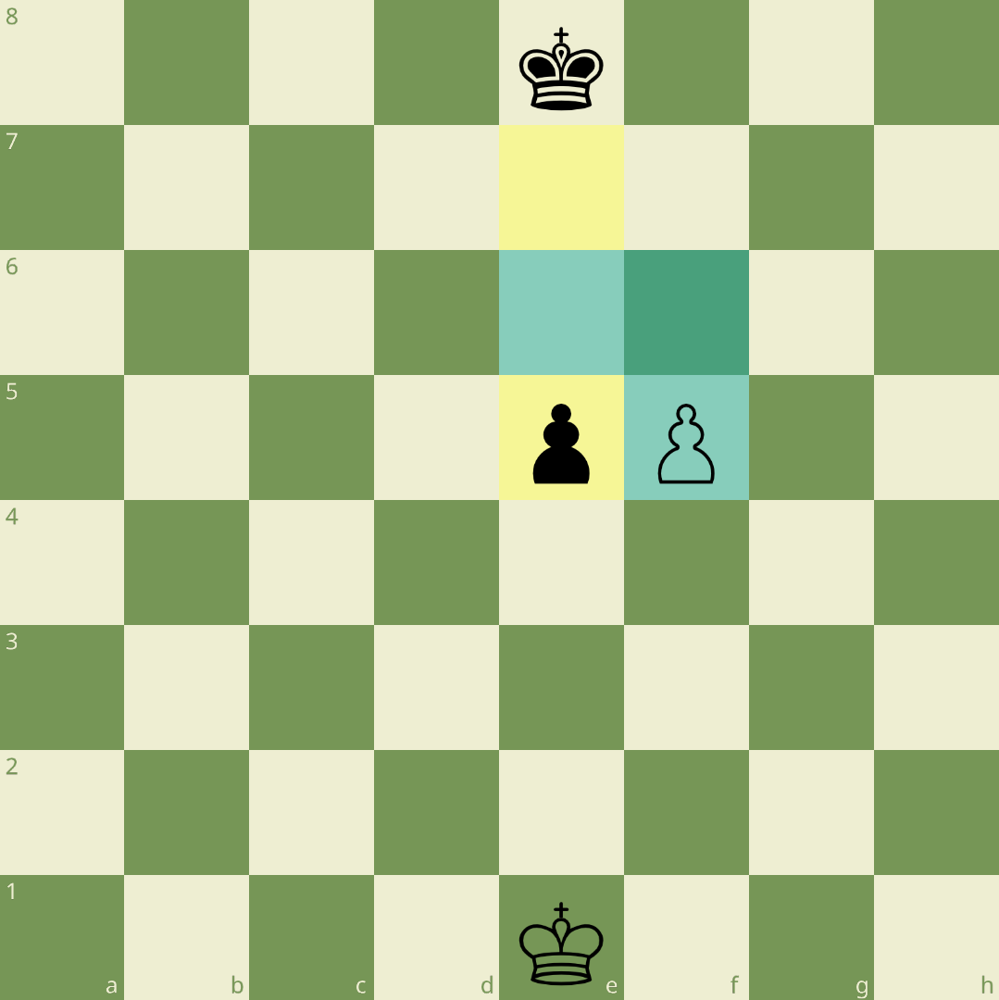
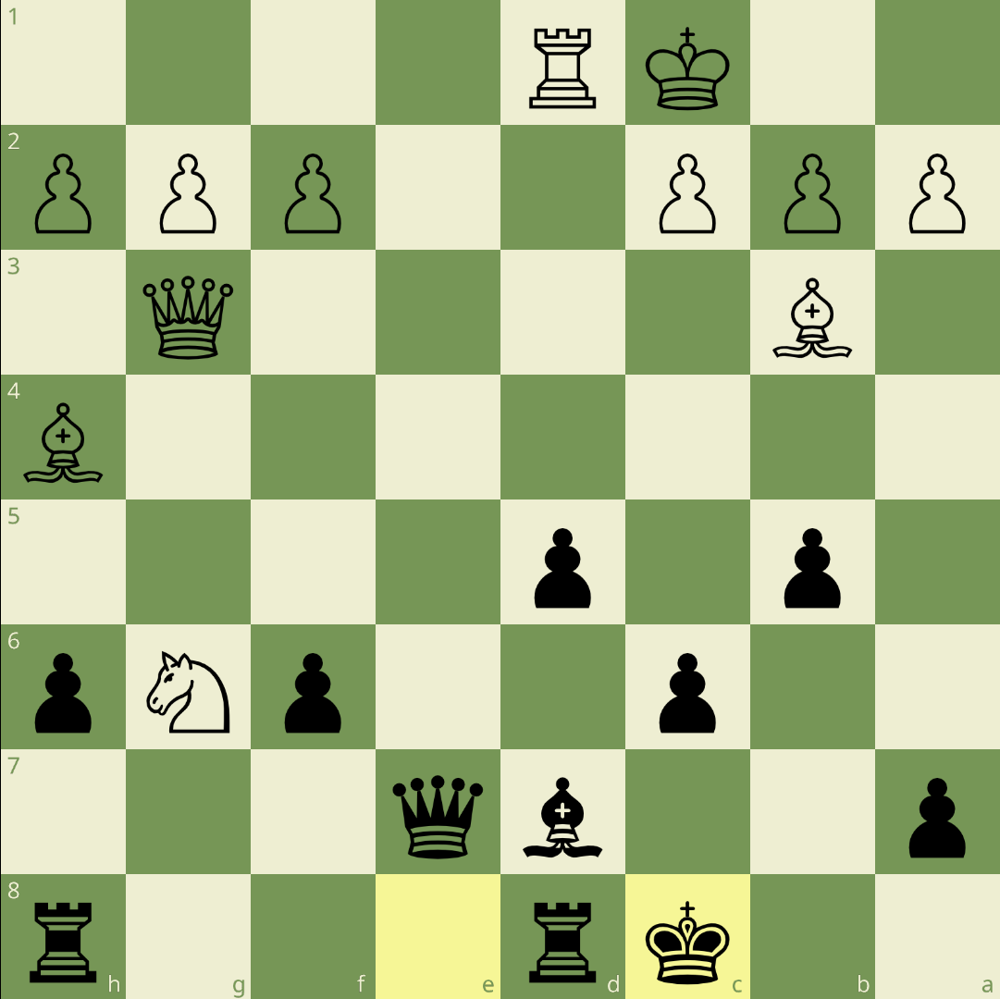

<p align="center" style="margin-bottom: 0px !important;">
  
</p>
<h1 align="center" style="margin-top: 0px;">Ruby Chess</h1>
</p>

<h3 align="center" >This is an implementation of chess game, written in Ruby using <a href="https://github.com/gosu/gosu" alt="gosu">Gosu </a>2D game development library.</h3>

<div align="center">
</img> </img> </img> </img> </img> </img>
</div>


### Assignment requirements:
* To "*build a command line Chess game where two players can play against each other.*"
I decided to produce a game with a graphical approach instead, using Gosu gem.

* It should prevent players from making illegal moves and declare check or check mate in the correct situations.

* Save / load game at any time.


### Features:

* game state management (menu, board, promotion, load)

* prevents player from making illegal moves

* prevents player from moving into check or ignoring check

* en passant capture

* castling

* pawn promotion menu

* highlights legal moves if mouse is hovered over square with piece or when piece is selected

* highlights king in check

* highlights last move

* auto-flip - board flips to side to move, after every move

* shows board coordinates and changes depending on current turn

* move / capture sound effects

* load of saved games


### Overview:

Each type of chess piece has its own method of movement, they are always constrained to legal moves. All legal moves are possible, including castling, pawn promotion and en passant. When a king is in check and it is under attack by at least one enemy piece. The direct attacked piece or pawn is then called [pinned](https://en.wikipedia.org/wiki/Pin_(chess)), and cannot move out of the line of attack, without leaving the indirectly attacked piece en prise or illegally its own king in check (in chess programming, to detect pins is necessary for legal move generation). Games can be saved, loaded and resumed at any time.

### Thoughts and Ordeals:

A chess program needs an internal board representation to maintain chess positions for its game-play, also some additional information is required to fully specify a chess position, such as side to move, castling rights, possible en passant target square etc. My first attempt at implementing a board was [10x12](https://www.chessprogramming.org/10x12_Board) representation. However, later I switched to more hybrid solution using PGN and Forsyth-Edwards Notation [(FEN) parser for Ruby](https://github.com/capicue/pgn) to recreate [8x8](https://www.chessprogramming.org/8x8_Board) board. A FEN string can therefore easily be derived from an array of any position along with some additional information which I mentioned above. An issue with this approach may be that passing new instances of parser to recreate board many times in a program uses significant resources, especially when you need to check every move for a check, but since speed is not important here (since it is not a chess engine), this solution worked for me. Therefore a FEN string can be easily serialized which makes it much undeniably beneficial to save and load the game state.

Beyond the technical aspects, it is primarily the solution to a broadly scoped problem integrating various coding / logic problem solving skills together in a clean and modular way. It was created solely to improve my Ruby programming skills. There were a lot of things that only became obvious after encountering / working through them, as such I was required break the problem down into many components. If you actually want to play chess then you should probably choose a more capable app or on-line service.

### Installing and Playing:

Project requires [gosu](https://github.com/gosu/gosu) and [pgn parser](https://github.com/capicue/pgn) to run. To install them:

```
gem install gosu
gem install pgn
```


Once the gems are installed, just clone repository and run it with Ruby in root `chess` directory:

```
git clone https://github.com/steimo/chess
cd chess

ruby main.rb
```
### Game Controls:

| Button        | Function      |
| ------------- |:-------------:|
| `LMB (left mouse button)    `  | select piece     |
| `RMB (right mouse button) `   | deselect piece     |
| `U`      | flip board  manually   |
| `ESC   `  | return to menu    |


### Possible Improvements:

* draw conditions

* test coverage

* play against the computer

* information highlight: game in progress, checkmate, stalemate and draw


### Resources used:

* [GNU Unifont](http://unifoundry.com/unifont/index.html)

* [Chess Merida Unicode TrueType font](https://github.com/xeyownt/chess_merida_unicode)

* Sound Effects: move & capture from  [lichess.org repository](https://github.com/lichess-org/lila)

* [Gosu 2D game development library](https://github.com/gosu/gosu)

* [A PGN parser and FEN generator for ruby](https://github.com/capicue/pgn)

### Contact me:

vladyslav.kolomiets@protonmail.com

### Contributing:

Pull requests are welcome.
